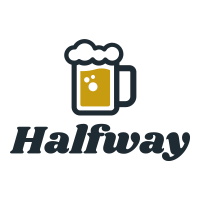

# README

# Halfway
An app built with React Native, Halfway calculates the halfway point between two places and 
returns a list of locations from the Yelp Api closest to that halfway point. From there a user can
add further filters to those results.

### Expo Link
https://expo.io/@phetzel/projects/halfway

### Technologies
- JavaScript
- React
- React Native
- Google Geocoding API 
- Yelp Data API

### Features
- Fully functional React Native App sucsessfully deployed on the iOS app store.
- Uses Google Geolocating to find the latitude and logitude between two user inputted locations.
- Uses the Yelp Api to find places based on that longitude and latitude as well as other filters

#### Future Features
- Auto-fill help for user inputs.
- Map visualization for results compared to initial addresses.
